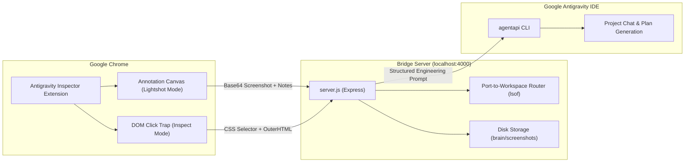

# 🚀 Antigravity Bridge & Visual Inspector

[]()
[](https://opensource.org/licenses/ISC)
[](https://github.com/CodeWithKaramjit/antigravity-bridge/pulls)
[](https://nodejs.org/)
[](https://expressjs.com/)
[](https://developer.chrome.com/docs/extensions/)
[]()
[](https://www.buymeacoffee.com/codewithkaramjit)

**Open source.** Anyone can use it, fork it, and contribute.

A seamless bridge connecting your local web projects directly to **Google Antigravity IDE**. 

Inspect any DOM element, take **Lightshot-style annotated screenshots** (with arrows, red boxes, freehand pen, and text labels), and send visual feedback directly into your project's active Antigravity chat with an automatic **Plan-Before-Execution protocol**.

---

## 🌟 Key Features

- **📸 Lightshot-Style Screenshot & Markup Tool**:
  - Full-screen high-DPI viewport capture.
  - **Drawing Tools**: Rectangle Boxes (🔲), Directional Arrows (↗️), Freehand Pen (✏️), and Text Notes (🔤).
  - **Color Palette**: Red (`#ef4444`, default), Blue (`#3b82f6`), Green (`#10b981`), Yellow (`#f59e0b`).
  - **Controls**: Undo (<kbd>Cmd + Z</kbd>), Clear, Cancel (<kbd>Esc</kbd>), and Done (<kbd>✓</kbd>).
  - Instant screenshot thumbnail preview in the feedback modal.

- **🎯 DOM Visual Element Inspector**:
  - Hover over any element on the page with real-time bounding box and dimensions.
  - **Disabled Element Support**: Uses a transparent click-trap and hit-testing layer so even `<button disabled>`, `<input disabled>`, or elements with `pointer-events: none` can be inspected without browser suppression.

- **⚡ Automatic Port-to-Workspace Routing**:
  - Inspecting `localhost:5173`, `localhost:5174`, or any port automatically resolves the underlying project directory via OS process tracing (`lsof`) and sends the feedback directly to that project's active Antigravity session!

- **🚨 Mandatory Plan-First Protocol**:
  - Every visual feedback request automatically instructs the Antigravity agent to create an `implementation_plan.md` first and wait for your explicit approval before modifying code.

- **🛡️ Complete Shadow DOM Isolation**:
  - All extension UI and overlays are rendered inside an open Shadow DOM root, ensuring zero CSS collision with your application.

---

## 🏗️ Architecture



---

## 🚀 Getting Started

### 1. Prerequisites
- **Node.js**: v18.0.0 or later
- **Google Antigravity IDE**: Installed and running on macOS

---

### 2. Install & Start Bridge Server

```bash
# Clone the repository
git clone https://github.com/CodeWithKaramjit/antigravity-bridge.git
cd antigravity-bridge

# Install dependencies
npm install

# Start Bridge Server
npm start
```
The server will start on `http://localhost:4000`. You can visit this URL in your browser to view the active workspaces dashboard.

---

### 3. Install Chrome Extension

1. Open Google Chrome and navigate to `chrome://extensions/`.
2. Enable **Developer mode** (toggle in the top-right corner).
3. Click **Load unpacked**.
4. Select the `chrome-extension` directory from this repository:
   ```
   /path/to/antigravity-bridge/chrome-extension
   ```
5. The **Antigravity Inspector** icon will appear in your Chrome toolbar.

---

## 🎮 How to Use

### Mode 1: Lightshot Screenshot & Annotation (Recommended)
1. Open your localhost web application (e.g., `http://localhost:5173` or `http://localhost:5174`).
2. Click the extension icon in Chrome toolbar and click **"📸 Screenshot & Annotate"** (or press <kbd>Option + S</kbd>).
3. Draw red boxes around elements to highlight, add arrows to point between components, or write text labels.
4. Click **Done (✓)** in the top floating toolbar.
5. In the modal, review your screenshot preview, type your instructions, and click **"Send to Antigravity"**.
6. Switch to your Antigravity IDE — your marked screenshot and prompt are already waiting in the chat!

### Mode 2: DOM Element Inspector
1. Click the extension icon and click **"🎯 Inspect DOM Element"** (or press <kbd>Option + A</kbd>).
2. Hover over any button, card, header, or disabled control.
3. Click the element to open the feedback modal with the CSS selector and HTML snippet pre-filled.
4. Type your instructions and click **"Send to Antigravity"**.

---

## ⌨️ Keyboard Shortcuts (Mac)

| Shortcut | Action |
| :--- | :--- |
| <kbd>Option + S</kbd> | Launch Screenshot & Annotation Mode |
| <kbd>Option + A</kbd> | Launch DOM Element Inspect Mode |
| <kbd>Cmd + Z</kbd> | Undo last drawn shape (in screenshot mode) |
| <kbd>Escape</kbd> | Exit inspect/screenshot mode or close modal |

---

## 🧪 Testing

Run the automated test suite covering health checks, workspace detection, port-based routing, feedback formatting, and screenshot persistence:

```bash
npm test
```

Sample output:
```
✔ 1. GET /health - Returns bridge status and active conversation
✔ 2. GET / - Serves Bridge Server status dashboard
✔ 3. GET /api/workspaces - Returns detected Antigravity workspaces
✔ 4. GET /health?url=http://localhost:5173 - Accurately routes to workspace by port 5173
✔ 5. POST /api/feedback - Validates required instructions (HTTP 400 on empty)
✔ 6. POST /api/feedback - Forwards UI feedback to target project chat with plan requirement
✔ 7. POST /api/feedback - Saves base64 annotated screenshot to disk and forwards to IDE
✔ 8. GET /health?url=http://justice-for-punjab.test - Routes to workspace by domain slug (Docker/Apache/custom domains)
✔ 9. CWD Guard - Never matches root / or user home directory as workspace CWD
✔ 10. POST /api/stop - Responds with shutdown confirmation
ℹ pass 10, fail 0
```

---

## 📡 API Reference

### `GET /health`
Returns server status, active project, and open conversation metadata.
- **Query Params**: `url` (optional, e.g. `?url=http://localhost:5174`)

### `GET /api/workspaces`
Returns a grouped list of all detected Antigravity workspace folders and recent activity.

### `POST /api/feedback`
Receives element feedback and screenshots from the extension and forwards to Antigravity IDE.
- **Payload**:
  ```json
  {
    "pageUrl": "http://localhost:5174/auth/login",
    "selector": "button.login-btn",
    "element": "<button class=\"login-btn\" disabled>Sign In</button>",
    "comment": "Change button background to emerald green",
    "screenshot": "data:image/png;base64,..."
  }
  ```

---

## 🏷️ Versioning Policy (SemVer)

This project strictly adheres to [Semantic Versioning](https://semver.org/):

- **Major Version (`X.0.0`)**: Bumped when major architectural changes, breaking updates, or significant new features are introduced (e.g. `2.0.0` added the complete Lightshot screenshot capture & annotation suite, disabled button hit-testing engine, and intelligent port-to-workspace routing).
- **Minor / Medium Version (`X.Y.0`)**: Bumped when backward-compatible medium features, new annotation shapes, or new API capabilities are added.
- **Patch / Minor Version (`X.Y.Z`)**: Bumped for small bug fixes, styling polishes, and minor maintenance adjustments.

---

## 🤝 Contributing

This project is **open source**. Pull requests, issues, and ideas from anyone are welcome.

1. Fork the repo and create a branch from `main`.
2. Make your change (bug fix, feature, docs, or tests).
3. Run `npm test` and `npm run lint` before you open a PR.
4. Open a pull request and describe what you changed and why.

Good first contributions include docs, tests, Chrome extension UX, and bridge-server bug fixes.

Found a bug or have an idea? [Open an issue](https://github.com/CodeWithKaramjit/antigravity-bridge/issues).

---

## ☕ Buy me a coffee

If this project saves you time, you can support it with a coffee. It is optional — contributions of code and issues help just as much.

[](https://www.buymeacoffee.com/codewithkaramjit)

---

## 📄 License

ISC License — free to use, modify, and contribute.

Built for seamless AI-assisted web development with Google Antigravity IDE.
